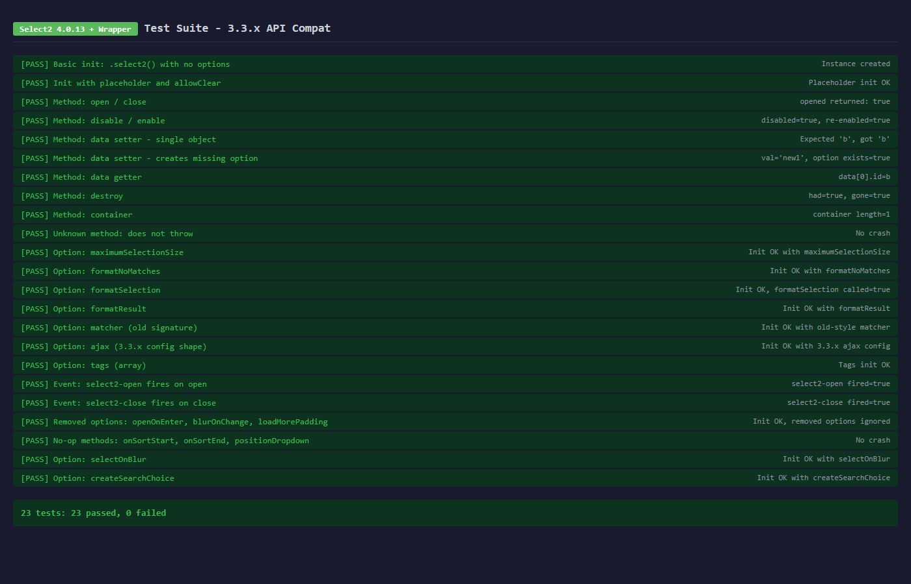
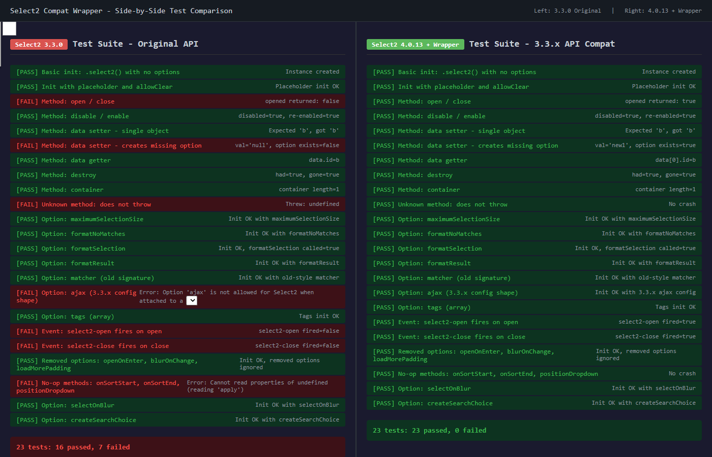
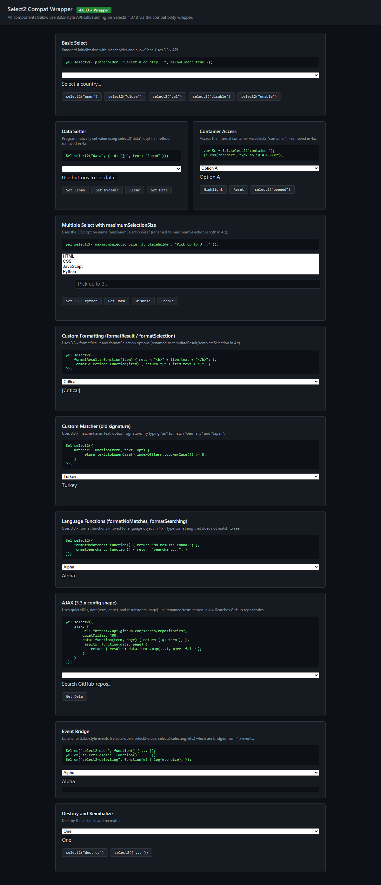

# select2-compat-wrapper

Backward compatibility wrapper for migrating from Select2 3.3.x to 4.0.13 without changing existing code.

Select2 3.x has known XSS vulnerabilities and is no longer maintained. This wrapper lets you upgrade to 4.0.13 while keeping your existing 3.3.x API calls intact. No need to refactor thousands of call sites across your project.

## Problem

Select2 4.x introduced major breaking changes:
- Methods renamed or removed (`disable`, `opened`, `isFocused`, `container`)
- `select2("data", obj)` no longer works as a setter
- Initialization options renamed (`formatResult` -> `templateResult`, `maximumSelectionSize` -> `maximumSelectionLength`, etc.)
- AJAX config structure changed (`quietMillis` -> `delay`, `results` -> `processResults`)
- `matcher` function signature completely changed
- Language/formatting functions moved to `language` object
- `tags` option changed from array/function to boolean
- Event namespace changed from `select2-` to `select2:`

Updating every usage across a large codebase is not practical. This wrapper translates 3.3.x calls to their 4.0.13 equivalents at runtime.

## Setup

Load the wrapper immediately after Select2 4.0.13:

```html
<link rel="stylesheet" href="select2.css" />
<script src="jquery.min.js"></script>
<script src="select2.full.js"></script>
<script src="select2-compat-wrapper.js"></script>
```

Your existing 3.3.x code continues to work as-is.

### Debug logging

Wrapper warnings are **off by default**. To enable them during development:

```js
$.fn.select2.compat.debug = true;
```

When enabled, the wrapper logs translation details and unsupported options/methods to `console.warn`. Keep it off in production.

## What the wrapper handles

### Method translation

| 3.3.x Call | Translated to |
|---|---|
| `$el.select2("data", value)` | Creates `<option>`, sets via `val().trigger("change")` |
| `$el.select2("disable")` | `$el.prop("disabled", true)` |
| `$el.select2("opened")` | `$el.select2("isOpen")` |
| `$el.select2("isFocused")` | `$el.select2("hasFocus")` |
| `$el.select2("container")` | Returns `instance.$container` |
| `$el.select2("onSortStart")` | No-op with console warning |
| `$el.select2("onSortEnd")` | No-op with console warning |
| `$el.select2("positionDropdown")` | No-op with console warning |

Methods that work natively in both versions (`open`, `close`, `destroy`, `focus`, `enable`, `val`, `data` getter) are passed through without modification.

### Option translation

| 3.3.x Option | Translated to |
|---|---|
| `formatResult` | `templateResult` |
| `formatSelection` | `templateSelection` |
| `formatNoMatches` | `language.noResults` |
| `formatInputTooShort` | `language.inputTooShort` |
| `formatInputTooLong` | `language.inputTooLong` |
| `formatSelectionTooBig` | `language.maximumSelected` |
| `formatLoadMore` | `language.loadingMore` |
| `formatSearching` | `language.searching` |
| `maximumSelectionSize` | `maximumSelectionLength` |
| `sortResults` | `sorter` |
| `createSearchChoice` | `createTag` |
| `selectOnBlur` | `selectOnClose` |
| `separator` | `valueSeparator` |
| `tags` (array/function) | `tags: true` + `data` |
| `matcher(term, text)` | Wrapped to match new `(params, data)` signature |
| `id` (function/string) | Stored internally for data remapping |

### Removed options (logged and dropped)

These 3.3.x options have no equivalent in 4.x. The wrapper removes them from the config and logs a warning so they do not cause errors:

- `openOnEnter`
- `blurOnChange`
- `loadMorePadding`
- `formatResultCssClass`

### AJAX translation

| 3.3.x | Translated to |
|---|---|
| `ajax.quietMillis` | `ajax.delay` |
| `ajax.results(data, page)` | `ajax.processResults(data, params)` |
| `ajax.data(term, page)` | `ajax.data(params)` |

Return value `{ more: true }` is converted to `{ pagination: { more: true } }`.

### Event bridge

The wrapper automatically re-emits 4.x events under their 3.3.x names so existing event listeners keep working:

| 4.x Event | Re-emitted as (3.3.x) |
|---|---|
| `select2:open` | `select2-open` |
| `select2:opening` | `select2-opening` |
| `select2:close` | `select2-close` |
| `select2:closing` | `select2-closing` |
| `select2:select` | `select2-selecting` + `select2-selected` |
| `select2:unselect` | `select2-removing` + `select2-removed` |
| `select2:clear` | `select2-cleared` |
| `select2:clearing` | `select2-clearing` |

Event data is mapped: `e.params.data` (4.x) is exposed as `e.choice` and `e.val` (3.3.x style). Calling `preventDefault()` on the legacy event propagates back to the 4.x event.

### Unknown methods

Any method call that does not exist in 4.0.13 and has no mapping will **not crash**. Instead, it logs a warning to the console and returns the jQuery object for chaining.

## What the wrapper does NOT handle

- **Hidden input elements**: Select2 3.x commonly used `<input type="hidden">`. Version 4.x has a compat module for this but it is deprecated. Consider migrating to `<select>` elements over time.
- **CSS class changes**: 4.x uses BEM-style class names. See the full mapping table below. If you have custom CSS targeting old class names, update those separately.
- **`formatResult` full signature**: The wrapper passes `null` for the `container` parameter and an empty object for `query`. If your formatter depends on those, adjust accordingly.

## CSS class migration reference

### Container

| 3.3.x Class | 4.x Class | Notes |
|---|---|---|
| `.select2-container` | `.select2-container` | Same |
| `.select2-container-active` | `.select2-container--focus` | Renamed |
| `.select2-container-disabled` | `.select2-container--disabled` | Renamed |
| `.select2-dropdown-open` | `.select2-container--open` | Renamed |
| `.select2-container-multi` | `.select2-container` (with `--multiple` on selection) | Removed, use selection class |
| `.select2-drop-above` | `.select2-container--above` | Renamed |
| `.select2-offscreen` | `.select2-hidden-accessible` | Renamed |

### Single select

| 3.3.x Class | 4.x Class | Notes |
|---|---|---|
| `.select2-choice` | `.select2-selection--single` | Renamed |
| `.select2-choice span` | `.select2-selection__rendered` | Renamed |
| `.select2-choice abbr` | `.select2-selection__clear` | Renamed |
| `.select2-choice div` | `.select2-selection__arrow` | Renamed |
| `.select2-choice div b` | `.select2-selection__arrow b` | Same structure |
| `.select2-default` | `.select2-selection__placeholder` | Renamed |

### Multiple select

| 3.3.x Class | 4.x Class | Notes |
|---|---|---|
| `.select2-choices` | `.select2-selection--multiple` | Renamed |
| `.select2-search-choice` | `.select2-selection__choice` | Renamed |
| `.select2-search-choice-close` | `.select2-selection__choice__remove` | Renamed |
| `.select2-search-choice-focus` | `.select2-selection__choice` (no focus class) | Removed |
| `.select2-search-field` | `.select2-search--inline` | Renamed |
| `.select2-search-field input` | `.select2-search__field` | Renamed |
| `.select2-locked` | N/A | Removed |

### Dropdown

| 3.3.x Class | 4.x Class | Notes |
|---|---|---|
| `.select2-drop` | `.select2-dropdown` | Renamed |
| `.select2-drop-above` | `.select2-dropdown--above` | Renamed |
| `.select2-drop-mask` | `.select2-close-mask` | Renamed |
| `.select2-search` | `.select2-search--dropdown` | Renamed |
| `.select2-search input` | `.select2-search__field` | Renamed |
| `.select2-search-hidden` | N/A | Removed, handled internally |
| `.select2-active` (on search input) | N/A | Removed, no loading indicator class |

### Results

| 3.3.x Class | 4.x Class | Notes |
|---|---|---|
| `.select2-results` | `.select2-results` | Same |
| `.select2-results li` | `.select2-results__option` | Renamed |
| `.select2-result-label` | `.select2-results__option` (text content) | Merged |
| `.select2-result-sub` | `.select2-results__option` (nested) | Nested via ARIA `role=group` |
| `.select2-highlighted` | `.select2-results__option--highlighted` | Renamed |
| `.select2-disabled` | `.select2-results__option[aria-disabled=true]` | Now attribute selector |
| `.select2-selected` | `.select2-results__option[aria-selected=true]` | Now attribute selector |
| `.select2-no-results` | `.select2-results__message` | Renamed |
| `.select2-searching` | `.select2-results__message` | Merged with no-results |
| `.select2-selection-limit` | N/A | Removed, handled by adapter |
| `.select2-match` | N/A | Removed, no match highlighting |
| `.select2-result-with-children` | `.select2-results__option[role=group]` | Now attribute selector |
| `.select2-more-results` | N/A | Removed, handled by InfiniteScroll adapter |

### Unchanged classes

These work the same in both versions:

- `.select2-container`
- `.select2-results`

## Test results

**4.0.13 + Wrapper: 23/23 passed**



**Side-by-side comparison** (left: 3.3.0 original, right: 4.0.13 + wrapper):



The 3.3.0 side shows some failures due to its own limitations (e.g., `ajax` not allowed on `<select>`, unknown methods throwing instead of logging, events not firing in headless context). The 4.0.13 + wrapper side passes all 23 tests.

**Live demo**: [https://gtrows.github.io/select2-compat-wrapper/test/](https://gtrows.github.io/select2-compat-wrapper/test/)

## Interactive demo

The demo page shows real working Select2 components using 3.3.x API calls on top of 4.0.13 + wrapper:



Components include:
- Basic select with placeholder/allowClear
- Data setter (`select2("data", obj)`) with dynamic option creation
- Container access (`select2("container")`)
- Multiple select with `maximumSelectionSize`
- Custom formatting via `formatResult` / `formatSelection`
- Old-style `matcher(term, text, option)`
- Language functions (`formatNoMatches`, `formatSearching`)
- AJAX with 3.3.x config (`quietMillis`, `data(term, page)`, `results(data, page)`)
- Event bridge (3.3.x-style event listeners on 4.x engine)
- Destroy and reinitialize

**Live interactive demo**: [https://gtrows.github.io/select2-compat-wrapper/test/demo.html](https://gtrows.github.io/select2-compat-wrapper/test/demo.html)

## Running the tests locally

The `test/` directory contains an automated test suite that runs the same scenarios against both versions:

```
test/
  index.html              <- Side-by-side comparison (open this)
  test-v3.html            <- Select2 3.3.0 original
  test-v4-wrapped.html    <- Select2 4.0.13 + compat wrapper
  shared-tests.js         <- Shared test scenarios
  lib/v3/                 <- Select2 3.3.0 files
  lib/v4/                 <- Select2 4.0.13 + wrapper files
```

Open `test/index.html` in a browser. Both panels run identical test scenarios:

1. **Basic init** - `.select2()` with no options
2. **Placeholder + allowClear** - Common init pattern
3. **open / close** - Method calls and `opened` return value
4. **disable / enable** - Toggling disabled state
5. **data setter (single)** - `select2("data", {id, text})`
6. **data setter (new option)** - Creates missing `<option>` dynamically
7. **data getter** - `select2("data")` read-only
8. **destroy** - Clean teardown
9. **container** - Access internal container element
10. **Unknown method** - Verifies no crash
11. **maximumSelectionSize** - Renamed option
12. **formatNoMatches** - Language function migration
13. **formatSelection** - Template function migration
14. **formatResult** - Template function migration
15. **matcher** - Old 3-arg signature wrapping
16. **AJAX config** - `quietMillis`, `data(term, page)`, `results(data, page)`
17. **tags (array)** - Array-style tags init
18. **select2-open event** - Event bridge fires on open
19. **select2-close event** - Event bridge fires on close
20. **Removed options** - `openOnEnter`, `blurOnChange`, `loadMorePadding` do not crash
21. **No-op methods** - `onSortStart`, `onSortEnd`, `positionDropdown` do not crash
22. **selectOnBlur** - Renamed option
23. **createSearchChoice** - Renamed option

Each test shows PASS or FAIL. The left panel (3.3.0) confirms the test is valid against the original API. The right panel (4.0.13 + wrapper) confirms the wrapper handles it correctly.

## Migration checklist

1. Replace `select2.js` (3.3.x) with `select2.full.js` (4.0.13)
2. Replace `select2.css` (3.3.x) with the 4.0.13 stylesheet
3. Add `select2-compat-wrapper.js` after `select2.full.js`
4. Test all pages that use Select2
5. Check any custom CSS targeting Select2 class names

## Full migration analysis

See [MIGRATION-ANALYSIS.md](MIGRATION-ANALYSIS.md) for a detailed breakdown of every difference between 3.3.x and 4.0.13.

## License

MIT
